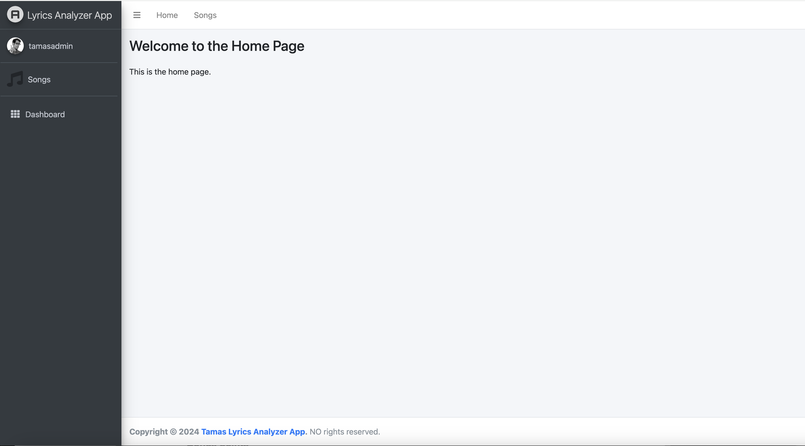
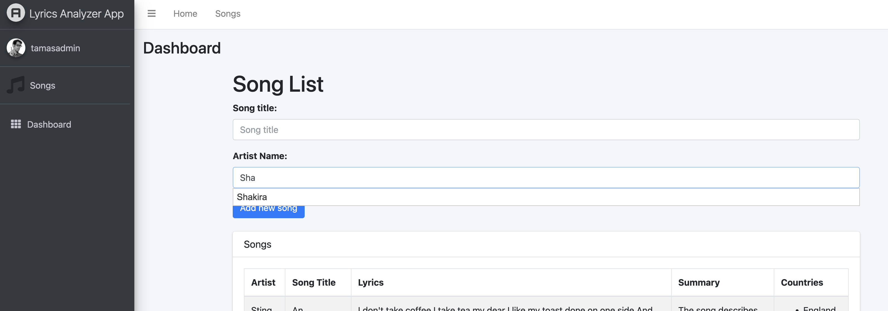
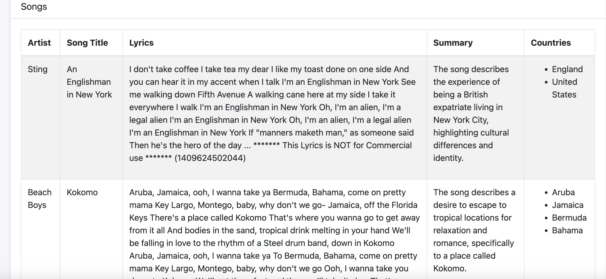
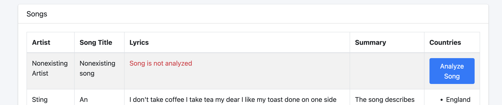
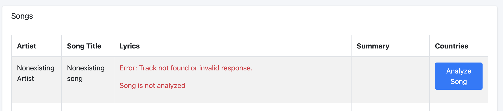

# Technical exercise for job application

## Description
The task is to create a web app, which accepts a song (Artist and Title) and provides a summary of each song’s lyrics and a list of any countries mentioned in the song.

## Requirements
- As an admin, I can add a song by providing the artist's name and song title
- As an admin, once the song has been processed by the app, I can see a summary of the
song's lyrics in 1 sentence (e.g. “This song is about love and growing up..”
- As an admin, I can see a list of countries mentioned in the song (or an empty string if no
countries are mentioned)

## Implementation
The solution implemented Django Python Framework.
For the layout the Adminlte3 template used. (https://adminlte.io/themes/v3/)
The requirements requested that only admins allowed to add songs. For this reason user registration is implemented.
Not just the superuser but any admin can add songs. (Users can be managed on /admin page)
The persistent store is PostgreSQL. The songs, artists, and processed data all stored in database.
There is no frontend framework implemented. The dynamic frontend and backend communication managed by jQuery.

## Installation
- Clone the repository
- Create a virtual environment
- Install the requirements `pip install -r requirements.txt`
- Create a PostgreSQL database
- Create .env file in the root directory and add the following variables:
```
DATABASE_NAME={database_name}
DATABASE_USER={database_user}
DATABASE_PASSWORD={database_password}
OPENAI_API_KEY={openai_api_key}
MUSIXMATCH_API_KEY={musixmatch_api_key}
```
- Run the migrations `python manage.py migrate`
- Create a superuser `python manage.py createsuperuser`
- Run the server `python manage.py runserver`
- Access the admin panel `http://localhost:8000`

## Tests
Pytest added to requirements-dev.txt file. install dependencies then run the tests:
```
pytest
``` 
This is not a full coverage test suite, only a few tests added to demonstrate the testing capability.

## NO Live Demo
The app is not deployed yet.
An AWS SAM template file created to manage AWS deployment.
The template file is located in the root directory.
This includes a Beanstalk application and RDS database.
Github actions implemented to deploy the app from CI/CD pipeline.
Please note none of the deployment steps tested yet. I expect several errors. 
Also no AWS credentials added to the Github secrets which means the deployment will fail.
The pipeline is only for demonstration purposes.

## Screenshots
#### Home Page

#### Autocomplete function on artist input

#### Song details

#### New song

#### Error displayed when process failed



